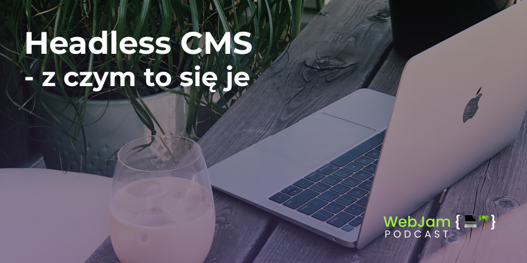

````javascript
let WEBJAM_01 - {
  title: 'Headless CMS - z czym to się je',
  instagram: 'webjamdev',
  twitter: 'hubertstrawa'
}
````

<br>
Czym jest Headless CMS, jakie są różnice pomiędzy podejściem Headless a tradycyjnym CMS, jakim jest np. Wordpress, Drupal czy Joomla. Który Headless CMS wybrać, bo jest ich sporo a Contentful, Strapi czy Prismic to tylko kilka przykładów. 
<br>

<br>
<iframe src="https://open.spotify.com/embed-podcast/show/203qO6W0A5RUdLLjFzBsWU" width="100%" height="232" frameborder="0" allowtransparency="true" allow="encrypted-media"></iframe>




## Show Notes 🗒

- [Jason's YT Video](https://youtu.be/DH7I1xRrbxs)

## Recommended 🚀

- Hubert: [my brother's dribbble profile](https://dribbble.com/kubastrawa)