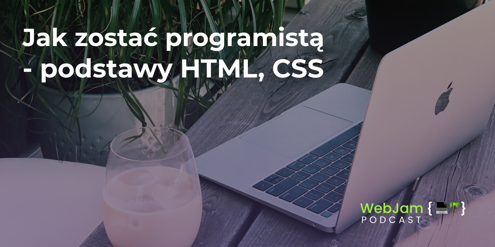

````javascript
let WEBJAM_03 - {
  title: 'Jak zostać programistą - podstawy HTML, CSS',
  instagram: 'webjamdev',
  twitter: 'hubertstrawa'
}
````

<br>
W dzisiejszym podcaście dowiesz się kto może zostać programistą, jak nauczyć się kodzić i jak zostać programistą. Oprócz tego opowiem co z podstaw HTML, CSS powinno się wiedzieć przed poszukiwaniem pierwszej pracy jako Junior Frontend Developer.
<br>

<br>
<iframe src="https://open.spotify.com/embed-podcast/episode/1ihaJsjchlwqCPjfEE5E8G" width="100%" height="232" frameborder="0" allowtransparency="true" allow="encrypted-media"></iframe>




## Recommended 🚀

- [HTML Reference](https://developer.mozilla.org/pl/docs/Web/HTML), [CSS Tricks](https://css-tricks.com/)

- [Helloroman](https://helloroman.pl/), [Wes Bos](https://wesbos.com/)
